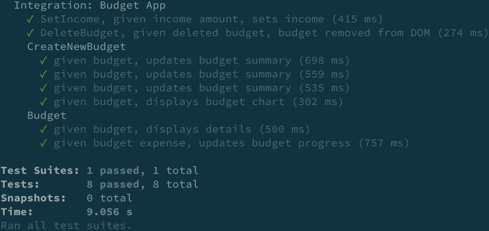

# Chapter 5: Refactoring Legacy Applications with React Testing Library
In this chapter, we're going to cover the following main topics:
* Using tests to catch regressions when updating dependencies
* Refactoring tests written with Enzyme
* Refactoring tests written with ReactTestUtils
* Refactoring tests to comply with common testing best practices
## Technical requirements
 We will be using the **create-react-app** CLI tool for all code examples. 
 ## Using tests to catch regressions when updating dependencies
 The budgeting application has the following [production dependencies](./example_1_starter/package.json#L9-L16):

 ```json
  "dependencies": {
    "@material-ui/core": "^1.4.2",
    "@material-ui/icons": "^2.0.1",
    "react": "^16.4.2",
    "react-dom": "^16.4.2",
    "recharts": "^1.1.0",
    "uuid": "^3.3.2"
  },
 ```

 The preceding code shows the current versions of all project dependencies. We will update **"@material-ui/core"** to version **"4.11.3"**, **"@material-ui/icons"** to version **"4.11.2"**, and **"recharts"** to version **"2.0.4"**, so the application has up-to-date dependency code. The approach we will use to update the dependencies will involve having a suite of automated tests running to help catch any regressions after each dependency is updated. The budgeting application does not have any existing tests.

 In situations where a legacy application **has no existing tests**, a great way to get started is by writing **automated UI end-to-end tests** for critical workflows before adding tests at other test levels. 

 ## Creating the regression test suite
 For the first test, we will target the ***setting the income*** functionality by verifying that a user can enter an amount for [**income**](./example_1_starter/src/components/App.test.js#L5-L9):

```javascript
  function setOneDollarIncome() {
    user.click(screen.getByText(/set income/i));
    user.type(screen.getByRole('spinbutton'), '1');
    user.click(screen.getByText(/submit/i));
  }
```
In the previous code, we create a function, **setOneDollarIncome**, to set an income amount of ***$1***. The **setOneDollarIncome** function will reduce repetitive code in successive tests. Next, we will write the main [test code](./example_1_final/src/components/App.test.js#L21-L31):

```javascript
  test('SetIncome, given income amount, sets income', () => {
    render(<App />);
    setOneDollarIncome();
    const leftOverBudget = screen.getByText(/left over:/i);
    const leftOverBudgetAmount = within(leftOverBudget).getByText(/\$1/i);

    expect(leftOverBudgetAmount).toBeInTheDocument();
    expect(
      screen.getByRole('heading', { name: /income: \$1/i })
    ).toBeInTheDocument();
  });
```

In the preceding code, first, we render the **App** component in the DOM. Next, we set an **income** amount of *$1* via the **setOneDollarIncome** function. Next, we grab the **left over** text and use the **within** method from React Testing Library to access the dollar amount text. The **within** method can be used in situations where we want to access the child elements of a parent element. When we run the application, ``the resulting HTML element output`` for the **Left Over** section on the screen is as follows:
```html
<p class="MuiTypography-root BudgetSummary-leftoverText-4   MuiTypography-body1">
  Left over: <span class="BudgetSummary-profit-6">$1</span>
</p>
```
In the preceding code, a **p** element has the text **Left over** as child content. In the test code, we grab the p element via the **Left Over** text and store it in the **leftOverBudget** variable. Then, we use within to grab the span element with the text $1 and store it in the **leftOverBudgetAmount** variable.

Finally, we assert that **leftOverBudgetAmount** is in the DOM. For the next test, we will target the ``creating a budget`` functionality by verifying the resulting amount in the ``Budget Summary`` [section](./example_1_final/src/components/App.test.js#L12-L19) once a user sets a budget:

```javascript
  function createCarBudget(amount = '5') {
    user.click(screen.getByText(/create new budget/i));
    user.selectOptions(screen.getByRole('combobox', { name: /category/i }), [
      screen.getByText('Auto'),
    ]);
    user.type(screen.getByRole('spinbutton'), amount);
    user.click(screen.getByText(/add budget/i));
  }
```
In the previous code, we create a function, **createCarBudget**, to reduce the repetitive steps of creating a budget that will be used in multiple test cases. A default value of **5** will be used if no value for the **amount** parameter is passed as an argument to the function. Next, we will write [the main test code](./example_1_final/src/components/App.test.js#L34-L42):
```javascript
    test.each`
      budgetAmount | spending           | leftOver
      ${'4'}       | ${'Spending: $5'}  | ${'$-4'}
      ${'5'}       | ${'Spending: $5'}  | ${'$-4'}
      ${'6'}       | ${'Spending: $10'} | ${'$-9'}
    `(
      'given budget, updates budget summary',
      ({ budgetAmount, spending, leftOver }) => {
```

n the preceding code, we use the **each** method from Jest to allow the same test to be run multiple times with different values. The **budgetAmount**, **spending**, and **leftOver** variables represent the test's values for each test iteration. We have three rows of data under the variables to pass into the variables for each of the three test runs. Next, we arrange and perform actions in [the test](./example_1_final/src/components/App.test.js#L43-L48):

```javascript
        render(<App />);
        setOneDollarIncome();

        createCarBudget(budgetAmount);
        const leftOverBudget = screen.getByText(/left over:/i);
        const leftOverBudgetAmount = within(leftOverBudget).getByText(leftOver);
```
In the preceding code, first we render the app in the DOM and invoke the **setOneDollarIncome** function. Next, we invoke the **createCarBudget** function and pass in the value of **budgetAmount** for the current test iteration. Next, we grab the element associated with the **Left Over Budget** section and assign it to the **leftOverBudget** variable, similar to what we did in the previous test. Finally, we make [the following assertions](./example_1_final/src/components/App.test.js#L50-L55):

```javascript
        expect(leftOverBudgetAmount).toBeInTheDocument();
        expect(
          screen.getByRole('heading', { name: spending })
        ).toBeInTheDocument();
      }
    );
```

In the previous code, first, we assert that **leftOverBudgetAmount** is in the DOM. Finally, we assert that the heading element for the current value of **name** is in the DOM. By way of a challenge, write a test that verifies that a budget chart is displayed for a created budget.

For the next test, we will target the ``deleting a budget`` functionality [by verifying that a deleted budget has been removed from the screen](./example_1_final/src/components/App.test.js#L91-L100):

```javascript
  test('DeleteBudget, given deleted budget, budget removed from DOM', () => {
    render(<App />);
    setOneDollarIncome();
    createCarBudget();

    user.click(screen.getByLabelText(/trash can/i));

    expect(screen.queryByRole('listitem')).not.toBeInTheDocument();
  });
});
```
In the preceding code, first, we arrange our test by rendering the **App** component in the DOM and invoking the **setOneDollarIncome** and **createCarBudget** functions. Next, we click the trash can icon. Finally, we assert that no **listitem** elements are in the DOM.

Since the **listitem** elements render the budgets on the screen, we can be confident that the functionality works as expected if none are found in the DOM. For the last test, we will target the ***budget details*** functionality [by verifying that adding expenses updates the budget's progress](./example_1_final/src/components/App.test.js#L78-L89):

```javascript
    test('given budget expense, updates budget progress', () => {
      render(<App />);
      setOneDollarIncome();
      createCarBudget();

      user.click(screen.getByRole('button', { name: /arrowright/i }));

      expect(
        screen.getByRole('heading', { name: /\$5 of \$5/i })
      ).toBeInTheDocument();
    });
  });
```

In the preceding code, first, we arrange our test by rendering the **App** component in the DOM and invoking the **setOneDollarIncome** and **createCarBudget** functions similar to the previous test. Next, we click the right arrow icon. Finally, we assert that the text, **$5 of $5**, is present on the screen.

As a challenge, try to write the code for the following test scenario: **Budget**, **given budget**, **displays details**. 

When we run our tests, we receive the following output:
###### Figure 5.5 – Budget app test results
   

The preceding screenshot shows that all the tests pass. Now that we have a passing regression test suite, we will upgrade the production dependencies for the application in the next section. It should be noted that our tests are automatically set up to run in **watch mode**, a Jest feature that automatically re-runs tests any time an associated component file is changed.

The watch mode feature provides you with confidence that we can quickly discover regressions as code changes are implemented. For projects not automatically set up to run Jest in watch mode, simply pass the **--watch** flag when you execute Jest from the command line.


## Upgrading the Material UI dependencies
In the previous section, we created a regression test suite. In this section, we will delete all highlighted text and get the latest dependency code by upgrading the ``@material-ui/icons`` and ``@material-ui/core`` dependencies. The ``@material-ui/icons`` package depends on ``@material-ui/core``, so we will update both dependencies simultaneously.

Inside the **package.json** file, replace the current version of ``@material-ui/icons 2.0.1 with 4.11.2``,`` @material-ui/core with 4.11.3``, and reinstall all dependencies. Now, when we run our tests, we receive the following output:

###### Figure 5.6 – Budget app failed test results
   

In the previous screenshot, the test results indicate that the dependency updates broke our tests. The results provide detailed information related to why each test failed. The following is a high-level version of the test results information displayed in the console:

```shell
Integration: Budget App › SetIncome, given income amount, sets income

    TestingLibraryElementError: Unable to find an accessible  
    element with the role "heading" and name `/income: \$1/i`

Integration: Budget App › Budget › given budget, displays details

    TestingLibraryElementError: Unable to find an accessible
    element with the role "heading" and name `/\$0 of \$5/i`

Integration: Budget App › Budget › given budget expense, updates budget progress

    TestingLibraryElementError: Unable to find an accessible
    element with the role "heading" and name `/\$5 of \$5/i`

Integration: Budget App › CreateNewBudget › given budget, updates budget summary

    TestingLibraryElementError: Unable to find an accessible
    element with the role "heading" and name "Spending: $10"

    TestingLibraryElementError: Unable to find an accessible
    element with the role "heading" and name "Spending: $5"
```
In the previous console output, the test results inform us of specific tests that failed due to not being able to find targeted **heading** elements in the DOM. When we updated the dependencies, a regression occurred in our source code. Error messages are also displayed in the console, providing information to pinpoint the problems in the source code. The following is a high-level version of the error messages displayed in the console:

```shell
Warning: Failed prop type: Invalid prop `spacing` of value `24` supplied to `ForwardRef(Grid)`, expected one of [0,1,2,3,4,5,6,7,8,9,10].

Warning: Failed prop type: Invalid prop `variant` of value `title` supplied to `ForwardRef(Typography)`, expected one of ["h1","h2","h3","h4","h5","h6","subtitle1","subtitle2","body1","body2","caption","button","overline","srOnly","inherit"].

Warning: Failed prop type: Invalid prop `variant` of value `subheading` supplied to `ForwardRef(Typography)`, expected one of ["h1","h2","h3","h4","h5","h6","subtitle1","subtitle2","body1","body2","caption","button","overline","srOnly","inherit"].

Material-UI: theme.spacing.unit usage has been deprecated.

It will be removed in v5.

You can replace `theme.spacing.unit * y` with `theme.spacing(y)`.
```

The error messages inform us that our source code is now using outdated property values from the material UI dependencies in the previous console output, which resulted in our tests not finding specific heading elements and failing. The error message output also tells us in which individual component file the error occurred under each error message. For example, the source of the error, ``Material-UI: theme.spacing.unit usage has been deprecated``., can be found here:[(src/components/SetIncome.js:27:26)](./example_1_starter/src/components/SetIncome.js#L14-L26)

The preceding console output informs us that the error source is on space **26** of line **27** of the **SetIncome** component file. Now that we know the specifics of why each test failed, we can update the source code appropriately.

We will keep our tests running in watch mode while updating the source code to add confidence we will catch any new regressions that may occur due to updating the code. 

Once we update the code in our component files based on the error messages, we receive the following output when we run our tests:
###### Figure 5.7 – Budget app updated dependency test results
 

The preceding screenshot shows that all tests are now passing after updating the source code based on the error messages. Now you know how to update production dependencies and add tests to legacy applications. The great thing about using React Testing Library during this task is knowing that we never need to update our test code while we update the source code.

Our test code does not depend on the components' implementation details, we are free to change the source code however necessary as long as the resulting DOM output and behavior do not change. In the next section, we will learn how to refactor tests for legacy code that uses Enzyme.


## Refactoring tests written with Enzyme
In the previous section, we learned how to update production dependencies and add component tests to legacy applications. In this section, we will learn how to replace existing legacy tests written in **Enzyme** with React Testing Library. Before React Testing Library was created, **Enzyme** was a popular library to test the UI of React components. **Enzyme** is a great tool, but the design of the API allows the implementation details of components to be tested, resulting in developers having to update test code frequently as they update their source code. We will replace legacy **Enzyme** tests with React Testing Library to resolve the problem of having to update tests that focus on implementation details continually.

We will use this approach to refactor legacy Enzyme tests to keep the current tests while installing and incrementally refactoring them with React Testing Library .***Working with React Testing Library***, for installation instructions. Once we are finished refactoring the legacy code and all tests are passing, we will remove Enzyme from the application. The tests will be refactored to tests created in the **Creating the regression test suite** section of this chapter. [The first test we will refactor verifies that a user can set an income amount](./example_2_starter/src/components/App.test.js#L9-L15):
```javascript
  test('SetIncome, given income amount, sets income', () => {
    const wrapper = mount(<App />);

    wrapper.find('SetIncome').props().setIncome(1);

    expect(wrapper.find('h3#income').text()).toEqual('Income: $1');
  });
```
In the preceding code, the **mount** method from Enzyme is used to render the **App** component in the DOM. Next, the **find** method is used to locate the **SetIncome** component and invoke the setIncome method with the value **1**. Finally, an assertion is made to verify that the text value of the **h3** element with the **id** of **income** equals **Income: $1**.

There are many implementation details that would break the test if changed. For example, if the names of the **SetIncome** component or the **setIncome** method are changed, the test would break. A change to **income id** would also break the test. [We can refactor the test to focus on the user's perspective like so](./example_1_final/src/components/App.test.js#L21-L28):
```javascript
test('SetIncome, given income amount, sets income', () => {
    render(<App />);

    setOneDollarIncome();
    const leftOverBudget = screen.getByText(/left over:/i);
    const leftOverBudgetAmount = within(leftOverBudget).getByText(/\$1/i);
    
    expect(leftOverBudgetAmount).toBeInTheDocument();
```
In the preceding code, we refactored the Enzyme test code that verifies that a user can set an income amount with React Testing Library. [The next test that we will refactor verifies that the Budget summary section is updated when a user creates a budget](./example_2_starter/src/components/App.test.js#L17-L28):
```javascript
test('given budget, updates budget summary', () => {
        const wrapper = mount(<App />);
        const budgetAmount = Math.ceil(parseInt(5, 10) / 5) * 5;
        wrapper.find('CreateNewBudget').props().addNewBudget({
          id: '1',
          category: 'Auto',
          amount: budgetAmount,
          amtSpent: 0,
        });
  wrapper.find('CreateNewBudget').props().setTotalSpending(budgetAmount);
```

In the preceding code, first we render the **App** component in the DOM. Next, we use the **ceil** method from the **Math** object and the **parseInt** method to round the passed-in budget amount of **5** to the nearest multiple of **5**. Next, we use the **find** method to call the **addNewBudget** method inside the **CreateNewBudget** component with an object representing the budget.

Then, we call the **setTotalSpending** method in the same component with the result of the **budgetAmount** variable. [Next, we will make assertions](./example_2_starter/src/components/App.test.js#L46-L47):
```javascript
        expect(wrapper.find('h3#spending').text()).toEqual('Spending: $5');
        expect(wrapper.find('span#leftover').text()).toEqual("$-5");
```
In the previous code, we assert that the text value of the **h3** element with the **id** of **spending** is equal to ``Spending: $5``. Finally, we assert that the text value of the **span** element with the **id** of **leftover** is equal to ``$-5``. [We can refactor the previous code with React Testing Library like so](./example_2_starter/src/components/App.test.js#L37-L47):
```javascript
test('given budget, updates budget summary', () => {
  render(<App />);
  setOneDollarIncome();
  createCarBudget(5);
  const leftOverBudget = screen.getByText(/left over:/i);
  const leftOverBudgetAmount = within(leftOverBudget).getByText('df');
  expect(leftOverBudgetAmount).toBeInTheDocument();
  expect(screen.getByRole('heading', { name: 'Spending: $5'})).toBeInTheDocument();
});
```
In the preceding code, we refactored the Enzyme test code that verifies that the ***Budget summary*** section is updated when a user creates a budget with React Testing Library. T[he next test that we will refactor verifies that a chart is displayed when a user creates a budget](./example_2_starter/src/components/App.test.js#L51-L62):
```javascript
    test('given budget, displays budget chart', () => {
      const wrapper = mount(<App />);
      const budgetAmount = Math.ceil(parseInt(5, 10) / 5) * 5;
      wrapper.find('CreateNewBudget').props().addNewBudget({
        id: '1',
        category: 'Auto',
        amount: budgetAmount,
        amtSpent: 0,
      });
      wrapper.find('CreateNewBudget').props().setTotalSpending(budgetAmount);
      wrapper.update();
```
In the preceding code, we render the **App** component in the DOM using the **mount** method and create a **budgetAmount** variable to convert the budget into a multiple of five similar to the previous test. Next. We use the **find** method to call the **addNewBudget** method inside the **CreateNewBudget** component and pass in a budget object.

Then, we call the **setTotalSpending** method inside **CreateNewBudget** and pass in the budget amount. Next, we call the **update** method to sync our test with the code created by the **Chart** component. [Next, we can make assertions](./example_2_starter/src/components/App.test.js#L60-L61):
```javascript
     expect(wrapper.find('div#chart')).toBeTruthy();
    });
```
In the preceding code, we assert that the **div** element with the **id** of **chart** is **truthy**, meaning it was found in the DOM. As we saw in the Creating the regression test suite section of this chapter, all the test cases for the budget application written in React Testing Library will pass as expected when run.

Now that all the Enzyme tests have been refactored to React Testing Library, we can remove the **enzyme** and **enzyme-adapter-react-16** dependencies from the **package.json** file. [We can also remove the following code from the **setupTests.js** file](./example_2_starter/src/setupTests.js):
```js
import Enzyme from 'enzyme';
import Adapter from 'enzyme-adapter-react-16';
Enzyme.configure({ adapter: new Adapter() });
```
The preceding code is used to configure Enzyme to work in the test files. The code is no longer needed after removing Enzyme from the application. Now you know how to refactor legacy tests created with Enzyme to React Testing Library. The React Testing Library tests provide greater confidence and reduce the chances of tests breaking when we refactor the source code.

In the next section, we will learn how to refactor tests created with **ReactTestUtils**.

## Refactoring tests written with ReactTestUtils
In the previous section, we learned how to convert tests written in Enzyme to React Testing Library. The process involved refactoring existing tests and then uninstalling the Enzyme library. In this section, we will use a similar process, only we will not have to uninstall an existing testing library. The **ReactTestUtils** module is included with React, so we can simply not import the module in our test file when we don't want to use it. Since the refactoring process is similar to the previous section, we will only look at one example in this section. [The test we will refactor verifies that a user can set an income amount](./example_2_starter/src/components/App.test.js#L3-L6):
```javascript
import React from 'react';
import ReactDOM from 'react-dom';
import { act } from 'react-dom/test-utils';
import App from './App';
```

In the preceding code, we import **React**, **ReactDOM**, and the **act** method. The **act** method imported from the **test-utils** module is used to sync component updates and ensure that our tests behave in ways similar to how React does in the browser. [Next, we will arrange the code needed for the test](./example_2_starter/src/components/App.test.js#L149-155):
```javascript
  it('SetIncome, given initial render, displays budget summary values', () => {
    let container = document.createElement('div');
    document.body.appendChild(container);

    act(() => {
      ReactDOM.render(<App />, container);
    });
```
In the preceding code, we create a **div** element to render in the DOM and assign it to the **container** variable. Next, we attach the **container** variable to the **body** element of the DOM. Then, we render the **App** component in **container**, wrapped in the **act** method. [Next, we will grab DOM elements and assert on their text values](./example_2_starter/src/components/App.test.js#L156-162):
```javascript
    const income = container.querySelector('h3#income');
    const spending = container.querySelector('#spending');
    const leftover = container.querySelector('#leftover');

    expect(income.textContent).toBe('Income: $0');
    expect(spending.textContent).toBe('Spending: $0');
    expect(leftover.textContent).toBe('$0');
```
In the preceding code, we use the querySelector method to access the income, spending, and leftover elements in the DOM. Then, we assert the values of the previous three elements using the **textContent** property. [Finally, we will add code to clean up the test](./example_2_starter/src/components/App.test.js#L164):
```javascript
    document.body.removeChild(container);
```
In the preceding code, we remove the container element from the DOM. Removing the container will ensure that we can start successive tests from a clean slate.[ We can refactor the previous test using React Testing Library](./example_1_final/src/components/App.test.js#L102-L112):
```javascript
it('SetIncome, given initial render, displays budget summary values', () => {
  render(<App />);

  const income = screen.getByRole('heading', { name: /income: \$0/i });
  const spending = screen.getByRole('heading', { name: /spending: \$0/i });
  const leftover = screen.getByText(/left over:/i);

  expect(income).toHaveTextContent('Income: $0');
  expect(spending).toHaveTextContent('Spending: $0');
  expect(leftover).toHaveTextContent('$0');
});
```

In the preceding code, we refactored the **SetIncome, given initial render, displays budget summary values** test using React Testing Library. The React Testing Library version of the test is cleaner and is more resilient to source code changes because it does not select DOM elements using implementation details. When we run the test, we get the following output:

###### Figure 5.8 – Passing the set income test
   

The results show that the **SetIncome, given initial render, displays budget summary values** test passes as expected in the previous code. Now you know how to refactor tests created with the **ReactTestUtils** module. The skills learned in this section will arm you with the knowledge to refactor legacy test code to use modern testing tools.

## Refactoring tests to comply with common testing best practices
In the previous section, we learned how to refactor tests created with ReactTestUtils. In this section, we will cover a few scenarios where we can refactor existing test code to be more robust and maintainable. We will use the following feedback form application to illustrate examples:

###### Figure 5.9 – Feedback form
  

In the preceding screenshot, we have a form for users to complete the **Name** and **Email** fields, as well as select a rating, enter comments, and finally, submit their information. If a user tries to submit the form with blank values for the required fields, an error message is displayed:

###### Figure 5.10 – Feedback form error validation
  

In the preceding screenshot, form validation errors are displayed under each input with blank values. Finally, when a user submits the form with valid input data, a **Thank you** message is displayed:

###### Figure 5.11 – Submitted feedback form
 

In the preceding screenshot, the message **We appreciate your responses John Doe!** is displayed. The **John Doe** part of the message is the value entered for the **Name** input element in the form. [The first test we will refactor verifies that an error message is displayed when invalid emails are entered](./feedback_final/src/App.test.js#L52-L59):
```javascript
test.each`
  value
  ${'a'}
  ${'a@b'}
  ${'a@b.c'}
`('displays error message', async ({ value }) => {
```
In the preceding code, first, the **each** method from Jest was used to run the same test with different values: **a**, **a@b**, and **a@b.c**. Next, we see the test name, **displays error message**. The test name is vague because it does not provide enough details regarding the context of the test. It is common to use test naming conventions to eliminate issues with vague test names. There are many popular naming conventions, such as **when_stateUnderTest_expect_expectedBehavior** and **given_preconditions_when_stateUnderTest_then_expectedBehavior**, that describe the code under test, the actions performed on the code, and finally, the expected result. The important thing to remember is to use a naming convention in agreement with your project team.

We will use the following convention, **component under test**, **given preconditions**, **expected results**, in our refactoring efforts. We can refactor the current test name like so:
```javascript
 'Form, given invalid email value "$value", displays error message',
```
In the preceding code, we refactor the current test name to **Form, given invalid email value "$value", displays error message**. When reading the test name, it is clear now that we are testing a Form component, the given preconditions are invalid values, and the expected result is to see an error message on the screen. Notice the **$value** variable in the test name. The variable will be replaced with the name of the current value for each test iteration, further providing context to understand the specific test code.

Next, we will analyze and refactor the main test code:
```javascript
  async ({ value }) => {
    const { getByRole, getByText } = render(<App />)
    const emailInput = getByRole('textbox', { name: /email/i })
    user.click(emailInput)
    user.tab()
    user.type(emailInput, value)

    await waitFor(() => {
      const errorMessage = getByText(/invalid email address/i)
      expect(errorMessage).toBeInTheDocument()
    })
  }
)
```

In the preceding code, the object destructuring approach was used to access the **getByRole** and **getByText** query methods. However, the destructing approach requires you to manually keep track of which queries to add or remove as you build out the test code. As mentioned in Chapter 1, Exploring React Testing Library, we can use the **screen** object to access query methods starting in version **9** of React Testing Library.

Using the **screen** object to access query methods is easier to maintain and results in cleaner code than the destructuring approach. The **waitFor** method is also used to grab and verify that the error message is displayed asynchronously in the DOM. However, the **findBy*** queries of the **screen** object are also asynchronous and are easier-to-use options than **waitFor** when you need to query elements that take time to appear on the screen. [We can refactor the current test code like so](./feedback_final/src/App.test.js#L59-L70):

```javascript
  async ({ value }) => {
    render(<App />)
    const emailInput = screen.getByRole('textbox', { name: /email/i })

    user.click(emailInput)
    user.tab()
    user.type(emailInput, value)

    const errorMessage = await screen.findByText(/invalid email address/i)
    expect(errorMessage).toBeInTheDocument()
  }
)
```
In the preceding code, we replaced the destructured queries to access via the screen object. We also replaced the **waitFor** method with an asynchronous **findByText** query. Now the test code is cleaner and easier to maintain.

The next test we will refactor verifies that an error message is displayed when a user doesn't enter a value for any required form input:
```javascript
test('Form, given blank input value, displays error message',   async () => {
  render(<App />)

  const nameInput = screen.getByRole('textbox', { name: /name/i })
  const emailInput = screen.getByRole('textbox', { name: /email/i })
  const ratingSelect = screen.getByRole('combobox', { name: /rating/i })
  const commentsInput = screen.getByRole('textbox', { name: /comments/i })
```
In the preceding code, first, the application is rendered in the DOM. Next, the test is arranged by grabbing all the form **input** elements and storing them in respective values. Next, actions are performed on the form elements:
```javascript
  user.click(nameInput)
  user.click(emailInput)
  user.click(ratingSelect)
  user.click(commentsInput)
  user.tab()
```
In the preceding code, each **input** element is clicked. Then, pressing the ***Tab*** key on the keyboard simulates to move the focus away from the actively selected **ratingSelect** element. Finally, four assertions are made:
```javascript
  expect(await screen.findByText(/name required/i)).toBeInTheDocument()
  expect(await screen.findByText(/email required/i)).toBeInTheDocument()
  expect(await screen.findByText(/rating required/i)).toBeInTheDocument()
  expect(await screen.findByText(/comments required/i)).toBeInTheDocument()
```
In the preceding code, an assertion is made to verify that specific error messages are displayed for empty form values. However, if, for example, the first assertion for the **name required** error message fails, the test fails and none of the other assertions will be made. This approach of multiple assertions in the same test is not a good practice because we will not know whether the code for the remaining assertions works as expected.

Each assertion in the test is independent of other assertions, and therefore, should live inside their own individual test.[ We can refactor the test like so](./feedback_final/src/App.test.js#L34-L41):
```javascript
test.each`
  inputLabel
  ${'Name'}
  ${'Email'}
  ${'Rating'}
  ${'Comments'}
`(
  'Form, given blank $inputLabel input value, displays error message',
```
In the preceding code, first, we use the **each** method to create individual tests for the **Name, Email, Rating**, and **Comments input** element names. The input names will be passed to the **inputLabel** variable for each test run. [Next, we will write the main test code](./feedback_final/src/App.test.js#L42-L51):
```javascript
  async ({ inputLabel }) => {
    render(<App />)

    user.click(screen.getByText(`${inputLabel} *`))
    user.tab()

    const errorMessage = await screen.findByText(`${inputLabel} Required`)
    expect(errorMessage).toBeInTheDocument()
  }
)
```
In the preceding code, first, we render the **App** component in the DOM. Next, we click the input label using **getByText**. Then, we simulate pressing the Tab key to move the focus away from the **input** element. Finally, we grab the element with the error message, store it in the **errorMessage** variable, and verify that it is in the DOM. We get the following output when we run the refactored tests:

###### Figure 5.12 – Feedback form test results
 

In the preceding screenshot, all refactored test cases pass as expected. Now you know how to refactor tests to use testing best practices of naming conventions and splitting multiple assertions from one test into individual tests. You also learned how to refactor legacy tests written in React Testing Library to modern approaches.

# Summary
In this chapter, you have learned how to reduce the burden of updating production dependencies of legacy applications. You learned how to refactor legacy tests using the modern React Testing Library tool. You also learned a few testing best practices. The skills acquired in this chapter should give you the confidence that you can successfully refactor outdated code to current versions without significant issues. You should also be able to refactor test code to be more maintainable.

In the next chapter, we will learn about additional tools and plugins for testing.

# Questions
1. Explain the benefits of using React Testing Library compared to tools such as Enzyme or **ReactTestUtils**.
1. Explain the benefits of running tests in Jest's watch mode.
1. When should you use the **each** method from Jest when writing tests?